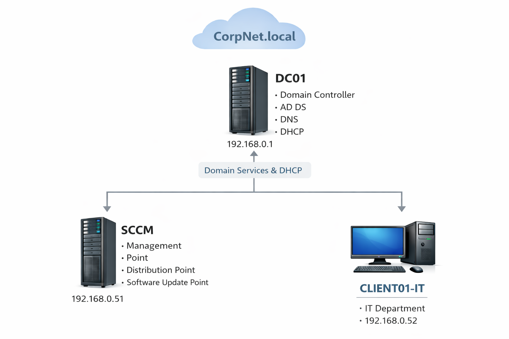

# Microsoft Endpoint Configuration Manager (MECM) Home Lab — End-to-End Build + Patch Management

## Project Summary
This project documents the full build of a Microsoft Endpoint Configuration Manager (MECM) Current Branch lab from the ground up using VirtualBox. The environment includes Active Directory, DNS, DHCP, SQL Server, WSUS, and an MECM Primary Site server configured with core roles including Management Point, Distribution Point, and Software Update Point. WSUS was integrated with MECM to enable centralized patch management and synchronization was validated through log monitoring and successful update deployments. Multiple Windows clients were domain-joined and configured with the ConfigMgr client to validate discovery, inventory, policy retrieval, and deployments. Application deployment and software update compliance were tested end-to-end. All major installation, configuration, and troubleshooting steps were documented to mirror real enterprise workflows and support reproducibility.

## Architecture Diagram

---

## Goals
- Build a fully functional MECM infrastructure from scratch  
- Create enterprise-style AD OU structure and device collections  
- Validate patch management workflow from sync to compliance  
- Deploy applications and software updates to test clients  
- Document real troubleshooting using MECM and WSUS logs  
- Produce a reproducible enterprise-style lab build  

---

## Lab Environment

| Component | Details |
|----------|--------|
| Hypervisor | VirtualBox |
| Domain | corpnet.local |
| MECM Site Code | HQC |
| Primary Site Server | SCCM.corpnet.local |
| Roles | MP, DP, SUP |
| SQL | SQL Server 2019 |
| WSUS | Installed on MECM server |
| Clients | Windows 10/11 domain joined |

**VM list screenshot:**  
`/screenshots/install/00-vms.png`

**IP plan screenshot:**  
`/screenshots/install/01-ip-plan.png`

---

## Architecture + Network Design

### Core Servers
- **DC01** — AD DS, DNS, DHCP  
- **SCCM** — MECM + SQL + WSUS + SUP + DP + MP  

### Clients
- IT-CL01  
- HR-CL01  
- MKT-CL01  

**Diagram:**  
 
---

## Deliverables (What This Lab Proves)
- MECM Primary Site installed and operational  
- WSUS integrated with Software Update Point  
- Successful synchronization confirmed in logs  
- Domain-joined clients receiving policy  
- Application deployment validated  
- Software update deployment and compliance confirmed  
- Real troubleshooting documented with log analysis  

---

## Skills Demonstrated

### Systems Administration
- Active Directory, DNS, DHCP deployment  
- Windows Server infrastructure design  
- Enterprise OU and group structure  

### Enterprise Endpoint Management
- MECM Current Branch installation  
- Boundary and discovery configuration  
- Client deployment and validation  
- Application deployment lifecycle  
- Patch management via SUP/WSUS  

### SQL + WSUS Integration
- SQL Server configuration for MECM  
- WSUS installation and content configuration  
- SUP synchronization and troubleshooting  

### Troubleshooting + Monitoring
- WCM.log analysis  
- WSyncMgr.log analysis  
- sitecomp.log usage  
- Client log troubleshooting  
- Deployment monitoring and validation  

---

## Business Value
- Demonstrates enterprise endpoint management workflow  
- Shows patch compliance and reporting capability  
- Simulates real corporate infrastructure  
- Documents repeatable build process  
- Highlights log-driven troubleshooting methodology  

---

## Documentation Index

| Section | Description |
|--------|-------------|
| Project Overview | Scope and objectives |
| Architecture | Network and role design |
| Build Plan | Step-by-step build order |
| Active Directory | Domain and OU structure |
| SQL Server | Configuration for MECM |
| WSUS + SUP | Patch infrastructure |
| MECM Install | Site installation |
| Discovery/Boundaries | Client targeting |
| Client Deployment | ConfigMgr client setup |
| Software Updates | Patch deployment |
| Applications | App deployment |
| OSD/PXE | Imaging (optional) |
| Reporting | Monitoring and compliance |
| Troubleshooting | Real issue resolution |
| Hardening | Backup and security notes |
| Lessons Learned | Final analysis |

---

## Build Verification Checklist
- Domain operational and clients join successfully  
- MECM console opens with healthy site status  
- Boundaries and boundary groups configured  
- Clients show **Client = Yes** in console  
- SUP configured successfully  
- WSyncMgr.log shows **Sync succeeded**  
- Updates populate in console  
- At least one deployment tested and successful  